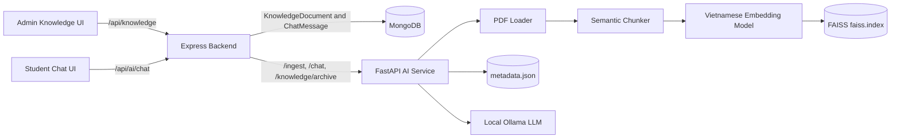
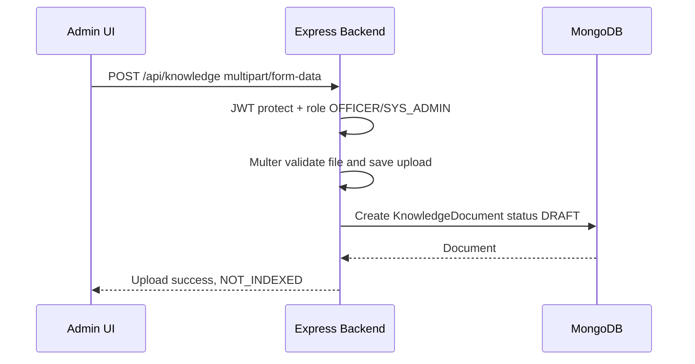
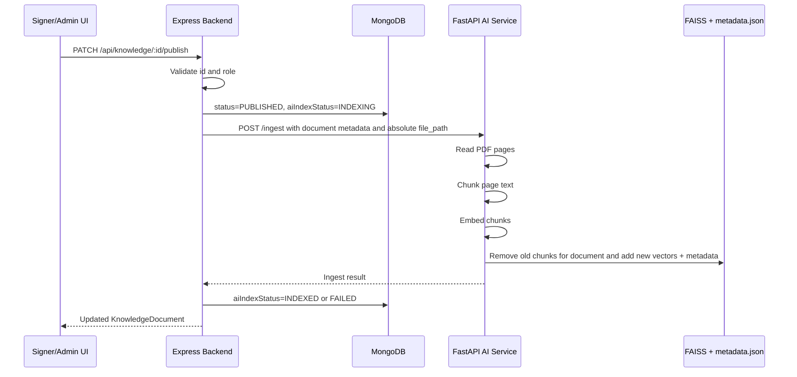
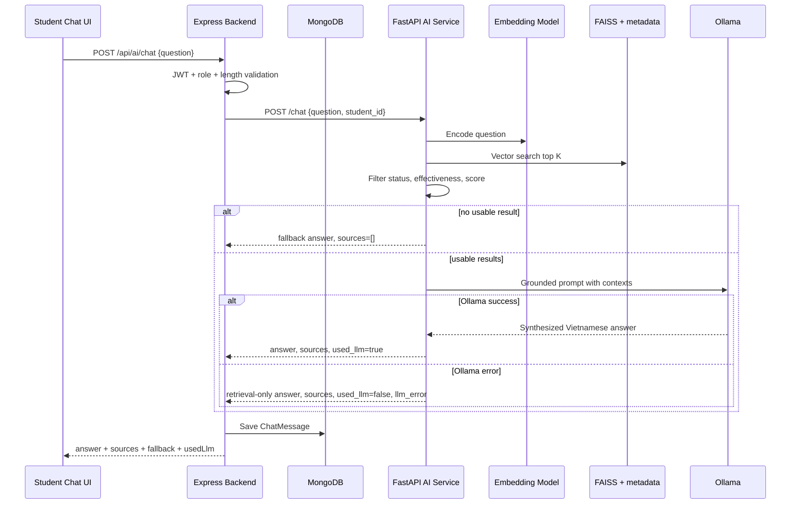

# D-CERT AI Flow

## 1. Muc dich cua phan AI

Phan AI trong D-CERT hien tai duoc thiet ke theo huong RAG, viet tat cua Retrieval-Augmented Generation. He thong khong de chatbot tu tra loi dua tren kien thuc tu do. Thay vao do, he thong:

1. Cho can bo dua van ban hoc vu vao kho tri thuc.
2. Chuyen van ban da duoc publish thanh cac chunk noi dung.
3. Ma hoa chunk thanh vector embedding tieng Viet.
4. Luu vector vao FAISS va luu metadata di kem vao JSON.
5. Khi sinh vien hoi, truy xuat cac chunk gan cau hoi nhat.
6. Neu co nguon phu hop, dua cac chunk do cho LLM local qua Ollama de tong hop cau tra loi.
7. Neu LLM khong san sang nhung retrieval van co ket qua, van tra loi bang doan tai lieu lien quan.
8. Neu khong tim thay nguon phu hop, tra ve fallback ro rang.

Muc tieu nghiep vu:

- Tra loi cau hoi hoc vu dua tren van ban da cong khai trong he thong.
- Dua ra nguon tham khao cho sinh vien kiem chung.
- De quan tri duoc vong doi van ban: upload, publish, reindex, archive.
- Tach ro backend nghiep vu va AI service de co the nang cap retrieval, embedding, LLM sau nay.

## 2. Tong quan kien truc

He thong AI khong nam trong mot service duy nhat. No duoc chia thanh ba lop:

| Lop | Cong nghe | Vai tro |
| --- | --- | --- |
| Frontend | React, Vite, Axios | Giao dien admin quan ly kho van ban va giao dien student chatbot |
| Backend nghiep vu | Express, MongoDB | Xac thuc JWT, phan quyen, luu KnowledgeDocument, luu ChatMessage, lam gateway den AI service |
| AI service | FastAPI, PyMuPDF, SentenceTransformer, FAISS, Ollama | Doc PDF, chunking, embedding, vector search, tao cau tra loi RAG |

Nguyen tac quan trong:

- Frontend chi goi Express qua prefix `/api`.
- Frontend khong goi truc tiep FastAPI.
- Backend Express la cong vao nghiep vu, role, logging chat va trang thai index.
- AI service xu ly retrieval va generation.

### 2.1 So do tong quan



## 3. Cac file chinh lien quan

### 3.1 Frontend

| File | Vai tro |
| --- | --- |
| `frontend/src/services/api.js` | Axios instance voi `baseURL: /api`, gan JWT vao request |
| `frontend/src/pages/admin/KnowledgePage.jsx` | Upload, filter, publish, reindex, archive kho van ban AI |
| `frontend/src/pages/admin/CreateDraftPage.jsx` | Cho phep danh dau PDF draft cong khai de tu dong vao Kho van ban AI sau khi issue |
| `frontend/src/pages/student/ChatbotPage.jsx` | Chat UI cho sinh vien |
| `frontend/src/App.jsx` | Route `/admin/knowledge` va `/student/assistant` |
| `frontend/src/components/layout/AdminLayout.jsx` | Menu admin co muc kho van ban AI |
| `frontend/src/components/layout/StudentLayout.jsx` | Menu student co muc tro ly hoc vu |

### 3.2 Backend Express

| File | Vai tro |
| --- | --- |
| `backend/src/routes/knowledgeRoutes.js` | Route upload, list, publish, archive, reindex van ban |
| `backend/src/controllers/knowledgeController.js` | Xu ly vong doi KnowledgeDocument va trang thai AI index |
| `backend/src/services/aiService.js` | Backend goi FastAPI de ingest/archive |
| `backend/src/services/knowledgeSyncService.js` | Tao KnowledgeDocument tu PDF da issue va ingest AI ma khong lam hong issue flow |
| `backend/src/routes/aiRoutes.js` | Route Express cho chat |
| `backend/src/controllers/aiController.js` | Validate cau hoi, goi FastAPI `/chat`, luu ChatMessage |
| `backend/src/models/KnowledgeDocument.js` | Schema van ban tri thuc |
| `backend/src/models/ChatMessage.js` | Schema lich su cau hoi va cau tra loi |
| `backend/src/middlewares/authMiddleware.js` | JWT protect va role authorization |

### 3.3 AI service FastAPI

| File | Vai tro |
| --- | --- |
| `ai-service/app/main.py` | FastAPI app, mount `/chat`, `/ingest`, `/knowledge` |
| `ai-service/app/api/ingest.py` | Endpoint ingest tai lieu |
| `ai-service/app/api/chat.py` | Endpoint chat retrieval |
| `ai-service/app/api/knowledge.py` | Endpoint archive metadata va rebuild index |
| `ai-service/app/services/pdf_loader.py` | Doc text tung trang PDF bang PyMuPDF |
| `ai-service/app/services/chunker.py` | Lam sach va chia text thanh chunk |
| `ai-service/app/services/embedder.py` | Tao embedding query va chunk |
| `ai-service/app/services/vector_store.py` | FAISS index va metadata store |
| `ai-service/app/services/rag_service.py` | Orchestrate ingest va answer flow |
| `ai-service/app/services/llm_service.py` | Goi Ollama de tong hop cau tra loi grounded |

## 4. Du lieu va trang thai

## 4.1 KnowledgeDocument trong MongoDB

Moi van ban duoc backend luu thanh mot `KnowledgeDocument`.

Thong tin nghiep vu chinh:

| Field | Y nghia |
| --- | --- |
| `title` | Ten van ban |
| `type` | Loai van ban |
| `fileUrl` | URL file upload backend phuc vu |
| `filePath` | Duong dan file vat ly backend chuyen cho AI service |
| `originalFileName` | Ten file goc |
| `mimeType`, `fileSize` | Thong tin file |
| `sourceUnit` | Don vi ban hanh |
| `issuedDate` | Ngay ban hanh |
| `effectiveFrom`, `effectiveTo` | Khoang hieu luc |
| `uploadedBy` | Nguoi upload |
| `publishedBy`, `publishedAt` | Nguoi publish va thoi diem publish |
| `archivedBy`, `archivedAt` | Nguoi archive va thoi diem archive |

Trang thai van ban:

| Status | Y nghia |
| --- | --- |
| `DRAFT` | Da upload nhung chua dua vao kho tri thuc AI |
| `PUBLISHED` | Da cong khai va duoc phep index vao AI |
| `ARCHIVED` | Da luu tru, khong nen duoc chatbot uu tien su dung |

Trang thai AI index:

| AI index status | Y nghia |
| --- | --- |
| `NOT_INDEXED` | Chua index |
| `INDEXING` | Dang goi AI service de index |
| `INDEXED` | Ingest thanh cong |
| `FAILED` | Ingest that bai |

Field phuc vu theo doi loi:

- `indexedAt`: lan index thanh cong gan nhat.
- `indexError`: thong bao loi index neu co.

## 4.2 ChatMessage trong MongoDB

Moi cau hoi qua Express backend duoc luu thanh `ChatMessage` sau khi AI service tra ve ket qua.

Thong tin chinh:

| Field | Y nghia |
| --- | --- |
| `user` | User da hoi |
| `studentId` | Ma sinh vien neu co |
| `question` | Cau hoi sau khi trim |
| `answer` | Cau tra loi tra ve |
| `sources` | Danh sach nguon tu retrieval |
| `fallback` | Co phai tra loi fallback vi khong co nguon hay khong |
| `usedLlm` | Co dung Ollama de tong hop hay khong |
| `llmError` | Loi LLM neu retrieval co ket qua nhung Ollama loi |

Y nghia tien do:

- He thong da co dau vet truy van chatbot o backend.
- Co the phan tich chat log sau nay de danh gia cau hoi pho bien, ty le fallback, ty le LLM loi.

## 4.3 Vector store trong AI service

AI service hien tai luu vector store theo dang demo local:

| Artifact | Duong dan | Vai tro |
| --- | --- | --- |
| FAISS index | `ai-service/app/storage/faiss.index` | Luu vector embedding de similarity search |
| Metadata JSON | `ai-service/app/storage/metadata.json` | Luu noi dung chunk va metadata di kem tung vector |

Moi metadata chunk co the gom:

- `document_id`
- `title`
- `type`
- `source_unit`
- `issued_date`
- `effective_from`
- `effective_to`
- `page`
- `chunk_index`
- `content`
- `status`
- `ingested_at`

Quan he giua hai file:

- Vi tri vector trong FAISS va vi tri object trong `metadata.json` duoc dung cung index.
- Khi search ra vector index `idx`, AI service lay `metadata[idx]` de tao source va content context.
- Vi vay khi reset test, khong nen chi xoa mot trong hai artifact.

## 5. API surface hien tai

## 5.1 API frontend goi backend Express

### Chat

| Method | Endpoint | Role | Body | Vai tro |
| --- | --- | --- | --- | --- |
| `POST` | `/api/ai/chat` | `STUDENT`, `SYS_ADMIN` | `{ "question": "..." }` | Chat voi tro ly hoc vu |

### Kho van ban AI

| Method | Endpoint | Role | Vai tro |
| --- | --- | --- | --- |
| `GET` | `/api/knowledge` | `SYS_ADMIN`, `OFFICER`, `SIGNER` | Lay danh sach van ban |
| `POST` | `/api/knowledge` | `SYS_ADMIN`, `OFFICER` | Upload van ban multipart |
| `PATCH` | `/api/knowledge/:id/publish` | `SYS_ADMIN`, `SIGNER` | Publish va ingest |
| `PATCH` | `/api/knowledge/:id/archive` | `SYS_ADMIN`, `SIGNER` | Archive backend va metadata AI |
| `POST` | `/api/knowledge/:id/reindex` | `SYS_ADMIN`, `SIGNER` | Reindex van ban published |

Bo loc danh sach knowledge:

- `search`
- `status`
- `type`
- `aiIndexStatus`
- `page`
- `limit`

## 5.2 API backend Express goi FastAPI

| Method | FastAPI endpoint | Goi tu dau | Vai tro |
| --- | --- | --- | --- |
| `POST` | `/ingest` | `backend/src/services/aiService.js` | Dua van ban published vao vector store |
| `POST` | `/chat` | `backend/src/controllers/aiController.js` | Truy xuat va tao cau tra loi |
| `POST` | `/knowledge/archive` | `backend/src/services/aiService.js` | Danh dau metadata chunk la archived |

FastAPI con co endpoint:

| Method | Endpoint | Vai tro |
| --- | --- | --- |
| `GET` | `/health` | Health check |
| `POST` | `/knowledge/rebuild-index` | Tao lai FAISS tu metadata `PUBLISHED` |

`/knowledge/rebuild-index` hien la endpoint truc tiep cua AI service, chua thay frontend hay Express route rieng de thao tac tu UI.

## 6. Luong 1: Upload van ban vao kho AI

Upload truc tiep o Kho van ban AI chua phai la index. Upload chi tao van ban backend o trang thai draft. Ngoai luong upload knowledge thu cong nay, Create Draft upload PDF co the luu cau hinh `knowledgeSync`; tai lieu do chi duoc tao thanh `KnowledgeDocument` va ingest sau khi SIGNER issue thanh cong.



### 6.1 Input upload

Form frontend gui:

- `title`
- `type`
- `sourceUnit`
- `issuedDate`
- `effectiveFrom`
- `effectiveTo`
- `file`

Loai van ban frontend va backend ho tro:

- `REGULATION`
- `DECISION`
- `ANNOUNCEMENT`
- `GUIDELINE`
- `FAQ`
- `OTHER`

### 6.2 Validate upload backend

Backend upload route dung Multer:

- File size gioi han 20 MB.
- MIME type duoc chap nhan tai upload route:
  - PDF
  - DOCX
  - TXT

Luu y hien tai:

- Route upload chap nhan PDF, DOCX, TXT.
- AI ingest trong `rag_service.py` va `pdf_loader.py` hien chi ho tro `.pdf`.
- Neu publish DOCX hoac TXT, kha nang index se that bai va `aiIndexStatus` ve `FAILED`.
- Day la mot diem can neu ro trong bao cao tien do neu muon mo rong dinh dang tai lieu.

## 7. Luong 2: Publish va ingest van ban

Publish la moc dua van ban vao kho retrieval AI.



### 7.1 Express publish handling

Khi `PATCH /api/knowledge/:id/publish`:

1. Backend validate Mongo ObjectId.
2. Backend tim `KnowledgeDocument`.
3. Neu van ban da `ARCHIVED`, backend khong cho publish lai.
4. Backend dat:
   - `status = PUBLISHED`
   - `publishedBy`
   - `publishedAt`
   - `aiIndexStatus = INDEXING`
   - `indexError = null`
5. Backend goi `aiService.ingestKnowledgeDocument(doc)`.
6. Neu ingest thanh cong:
   - `aiIndexStatus = INDEXED`
   - `indexedAt = now`
   - `indexError = null`
7. Neu ingest loi:
   - `aiIndexStatus = FAILED`
   - `indexError = error.message`

### 7.3 Tu dong dua PDF da issue vao Kho van ban AI

Neu OFFICER tick tuy chon trong Create Draft upload:

```text
Sau khi phat hanh, them tai lieu nay vao Kho van ban AI
```

backend luu metadata pending trong `Document.metadata.knowledgeSync`, gom:

- title
- type knowledge
- source unit
- issued date
- effective from
- effective to

Draft khong goi AI. Sau khi `issueDocument` hoac `batchIssue` tao PDF chinh thuc thanh cong:

1. Backend dung PDF issued o `/uploads/<docId>.pdf`.
2. `knowledgeSyncService` tao `KnowledgeDocument` co `origin = ISSUED_DOCUMENT`.
3. `sourceDocument` tro ve `Document` goc de tranh tao knowledge trung khi retry.
4. Knowledge moi duoc dat `status = PUBLISHED` va `aiIndexStatus = INDEXING`.
5. Backend goi ingest AI nhu publish knowledge binh thuong.
6. Neu ingest loi, issue van thanh cong; KnowledgeDocument giu `FAILED` va admin xu ly qua Kho van ban AI.

### 7.2 Payload Express gui FastAPI ingest

Backend chuyen du lieu thanh body JSON:

```json
{
  "document_id": "mongo_document_id",
  "title": "Ten van ban",
  "type": "ANNOUNCEMENT",
  "file_path": "absolute path to uploaded file",
  "source_unit": "Phong Dao tao",
  "issued_date": "ISO date or null",
  "effective_from": "ISO date or null",
  "effective_to": "ISO date or null"
}
```

Ly do dung `file_path`:

- Trong dev hien tai backend va AI service chay cung may local.
- Backend da luu file upload.
- AI service doc file tu absolute path thay vi nhan multipart upload lan hai.

He qua khi deploy phan tan:

- Neu backend va AI service khong cung filesystem, cach truyen absolute `file_path` can thay bang shared storage, object storage URL, hoac file transfer API.

## 8. Luong 3: AI service ingest noi bo

`ingest_document` trong `rag_service.py` la ham dieu phoi ingest.

### 8.1 Buoc 1: Validate file

AI service:

- Kiem tra file path ton tai.
- Kiem tra extension nam trong `SUPPORTED_EXTENSIONS`.
- Hien tai `SUPPORTED_EXTENSIONS = {".pdf"}`.

### 8.2 Buoc 2: Doc text theo trang

`pdf_loader.py` dung PyMuPDF:

1. Mo PDF.
2. Duyet tung page voi so trang bat dau tu 1.
3. Lay text qua `page.get_text("text")`.
4. Lam sach whitespace va newline.
5. Chi giu page co text.

Neu PDF scan khong co text layer:

- `pages` co the rong.
- AI service tra ket qua khong index duoc va thong bao tai lieu co the can OCR.

### 8.3 Buoc 3: Chunking

Moi page duoc chunk voi:

```python
chunk_text(page["text"], chunk_size=1000, overlap=200)
```

Chunker hien tai da duoc cai tien cho van ban hanh chinh tieng Viet:

- Chuan hoa newline.
- Bo blank line thua.
- Gom whitespace thua.
- Tach thanh paragraph/block theo dong.
- Uu tien gom cac dong muc/bullet lien tiep:
  - muc so nhu `1.`, `2.`
  - muc chu nhu `a.`, `b.`
  - bullet `•`, `-`, `+`
- Neu block qua dai moi tach theo dau cau va newline.
- Overlap uu tien theo block cuoi cua chunk truoc.
- Neu khong the overlap nguyen block thi overlap theo tail gan ranh gioi cau.

Gia tri cua chunker trong bai toan:

- Giam chunk bi bat dau giua cau nhu `"hanh, thi nghiem..."`.
- Giu cac muc dieu kien va bullet lien quan gan nhau hon.
- Cai thien context cho retrieval va LLM.

### 8.4 Buoc 4: Tao embedding

`embedder.py` dung:

```text
bkai-foundation-models/vietnamese-bi-encoder
```

Quy trinh:

1. Batch cac chunk text.
2. SentenceTransformer encode.
3. `normalize_embeddings=True`.
4. Chuyen vector sang `np.float32`.

Vi vector da normalize va FAISS index dung inner product, score retrieval co the dung nhu do tuong dong vector theo huong cosine trong bo cuc nay.

### 8.5 Buoc 5: Cap nhat vector store

Truoc khi add vector moi cho document:

- `remove_document(document_id)` loai chunk cu cua document neu da tung index.
- Neu con metadata khac, FAISS duoc rebuild tu metadata con lai.
- Neu khong con metadata, index cu bi xoa va metadata ve `[]`.

Sau do:

1. Add embeddings vao FAISS.
2. Tao metadata cho tung chunk.
3. Luu lai `faiss.index`.
4. Luu lai `metadata.json`.

Moi chunk metadata gan page va `chunk_index`, giup:

- Hien source page cho frontend.
- Hien excerpt tu noi dung chunk.
- Giu thong tin title, type, don vi, ngay hieu luc de loc va trinh bay nguon.

## 9. Luong 4: Student chat end to end



## 9.1 Frontend chat UI

Student page:

- Route: `/student/assistant`.
- Gui `POST /api/ai/chat`.
- Body: `{ question }`.
- Co loading text khi dang doi.
- Co fallback warning neu `fallback = true`.
- Co badge neu LLM da tong hop.
- Co badge retrieval-only neu co source nhung khong dung LLM.
- Hien source:
  - title
  - page
  - source unit
  - issued date
  - excerpt
- Khong hien similarity `score` cho sinh vien.

Message state phia frontend co shape:

```js
{
  id,
  role: "user" | "assistant",
  content,
  sources,
  fallback,
  usedLlm,
  createdAt
}
```

## 9.2 Express chat gateway

`aiController.js` thuc hien:

1. Validate `question` khong rong.
2. Gioi han do dai cau hoi toi da 1000 ky tu.
3. Lay `AI_SERVICE_URL`.
4. Gui FastAPI body:

```json
{
  "question": "Cau hoi sinh vien",
  "student_id": "student id or null"
}
```

5. Nhan tu FastAPI:
   - `answer`
   - `sources`
   - `fallback`
   - `used_llm`
   - `llm_error` neu co
6. Map `used_llm` thanh `usedLlm` de frontend dung.
7. Luu `ChatMessage`.
8. Tra response frontend:

```json
{
  "success": true,
  "message": "Chatbot tra loi thanh cong.",
  "data": {
    "answer": "...",
    "sources": [],
    "fallback": false,
    "usedLlm": true,
    "llmError": null
  }
}
```

Ghi chu hien tai:

- `student_id` da duoc truyen sang AI service.
- `answer_question(question, student_id)` hien chua dung `student_id` de personalize retrieval hay authorization theo tung sinh vien.

## 10. Retrieval pipeline chi tiet

## 10.1 Query embedding

AI service encode cau hoi bang cung embedding model tieng Viet voi chunk ingest.

Ket qua query embedding duoc dua vao FAISS search.

## 10.2 Vector search

Cac tham so hien tai trong `rag_service.py`:

| Tham so | Gia tri | Y nghia |
| --- | --- | --- |
| `TOP_K` | `8` | So ket qua vector lay tu FAISS truoc khi loc |
| `RETRIEVAL_THRESHOLD` | `0.35` | Score thap hon nguong bi bo |
| `FINAL_CONTEXTS` | `5` | So context cuoi cung dua vao answer/source |
| `MAX_EXCERPT_LENGTH` | `350` | Do dai excerpt source |
| `MAX_CONTEXT_PREVIEW_LENGTH` | `900` | Do dai preview retrieval-only |

## 10.3 Loc ket qua retrieval

Sau khi FAISS tra raw result, AI service bo ket qua neu:

- `score < 0.35`.
- `status != PUBLISHED`.
- Van ban chua hieu luc hoac da het hieu luc theo `effective_from`, `effective_to`.
- `content` rong.

Y nghia:

- Retrieval khong chi dua vao vector score.
- Van ban da archive khong duoc chatbot su dung nhu source hop le.
- Hieu luc van ban duoc tinh o lop AI metadata.

## 10.4 Sap xep ket qua

Ket qua hop le duoc sap xep theo hai y:

1. Uu tien score relevance giam dan.
2. Trong nhom score gan nhau, uu tien van ban moi hon theo `issued_date`.

Trong code, do gan nhau duoc kiem soat boi `RECENCY_SCORE_DELTA = 0.05`.

## 10.5 Tao source payload

Moi source tra ve co:

- `document_id`
- `title`
- `type`
- `page`
- `chunk_index`
- `source_unit`
- `issued_date`
- `effective_from`
- `effective_to`
- `excerpt`
- `score`

Frontend student hien tai chi hien thong tin co ich cho nguoi dung va khong hien `score`.

## 11. Generation pipeline voi Ollama

## 11.1 Khi nao dung LLM

LLM chi duoc goi khi:

- Retrieval co ket qua hop le.
- Da co `final_results` lam context.

## 11.2 Cau hinh Ollama hien tai

`llm_service.py` doc bien moi truong:

| Bien | Default trong code | Y nghia |
| --- | --- | --- |
| `OLLAMA_BASE_URL` | `http://localhost:11434` | Ollama endpoint |
| `OLLAMA_MODEL` | `dcert-qwen14b-vi` | Model generation |
| `OLLAMA_TIMEOUT` | `180` | Timeout request |
| `MAX_CONTEXTS` | `5` | So source context dua vao prompt |
| `MAX_CONTEXT_CONTENT_LENGTH` | `1200` | Gioi han ky tu moi context |

Trong `.env.example`, gia tri sample cua `OLLAMA_MODEL` dang la `qwen2.5:7b-instruct`. Khi viet bao cao hoac chay demo nen ghi ro model thuc te dang cau hinh o moi truong cua may demo.

## 11.3 Prompt grounding

System prompt buoc LLM:

- Tra loi bang tieng Viet co dau.
- Chi dua tren context duoc cung cap.
- Khong bia quy dinh, ngay thang, dia diem, so lieu.
- Khong dua quyet dinh hoc vu ca nhan thay nha truong.
- Neu context khong du thi noi khong tim thay thong tin trong van ban cong khai.
- Ket cau tra loi co phan nguon tham khao neu co.

User prompt gui:

- Cau hoi sinh vien.
- Danh sach context duoc gan nhan `[Nguon 1]`, `[Nguon 2]`, ...
- Metadata cua moi context:
  - ten van ban
  - loai
  - don vi ban hanh
  - ngay ban hanh
  - trang
  - noi dung chunk
- Yeu cau output:
  - `Tra loi ngan gon`
  - `Chi tiet`
  - `Nguon tham khao`

Day la lop kiem soat de LLM tong hop tren tai lieu da retrieve thay vi dong vai knowledge base tu do.

## 12. Ba che do tra loi

Chatbot hien tai co ba che do ket qua.

| Che do | Dieu kien | `fallback` | `usedLlm` | Y nghia UI |
| --- | --- | --- | --- | --- |
| Fallback no source | FAISS khong co ket qua hop le | `true` | `false` | Hien canh bao chua tim thay thong tin |
| Retrieval-only | Co source, Ollama loi | `false` | `false` | Hien badge tra loi dua tren doan tai lieu lien quan |
| RAG + LLM | Co source va Ollama thanh cong | `false` | `true` | Hien badge AI da tong hop tu nguon tai lieu |

### 12.1 Fallback no source

Neu:

- FAISS chua co index.
- Metadata rong.
- Score khong dat nguong.
- Chunks da archived.
- Van ban het hieu luc.

AI service tra fallback answer co tinh chat an toan:

- Khong tu suy dien.
- Noi chua tim thay thong tin phu hop trong cac van ban cong khai.
- Khuyen theo doi thong bao moi hoac lien he phong dao tao de xac nhan.

### 12.2 Retrieval-only

Neu retrieval co context nhung Ollama:

- timeout
- khong ket noi duoc
- tra response sai format
- tra noi dung rong

AI service van tra loi bang preview tu top retrieved result. Ket qua van co source va `llm_error` de backend luu.

Loi ich:

- Chatbot khong bi mat hoan toan khi LLM local chua san sang.
- Nguoi dung van thay van ban lien quan.

### 12.3 RAG + LLM

Neu Ollama thanh cong:

- `used_llm = true` o FastAPI.
- Backend map thanh `usedLlm = true`.
- Frontend hien badge tong hop AI.

## 13. Luong reindex

Reindex dung khi:

- Ingest lan dau that bai.
- File van ban hoac chunking logic duoc thay doi.
- Can cap nhat vector store cho van ban `PUBLISHED`.

Flow:

1. Frontend bam `Reindex`.
2. Express goi `POST /api/knowledge/:id/reindex`.
3. Backend chi cho phep neu document status la `PUBLISHED`.
4. Backend dat `aiIndexStatus = INDEXING`, xoa `indexError`.
5. Backend goi FastAPI `/ingest` lai voi cung document metadata va file path.
6. AI service remove old chunks cua document truoc khi add chunk moi.
7. Backend cap nhat `INDEXED` hoac `FAILED`.

## 14. Luong archive

Archive tac dong hai noi:

1. MongoDB backend.
2. Metadata AI service.

Flow:

1. Frontend bam `Archive`.
2. Express goi `PATCH /api/knowledge/:id/archive`.
3. Backend dat:
   - `status = ARCHIVED`
   - `archivedBy`
   - `archivedAt`
4. Backend goi FastAPI `/knowledge/archive`.
5. AI service duyet `metadata.json`, tim chunks cung `document_id`.
6. AI service dat:
   - `status = ARCHIVED`
   - `archived_at`

FAISS index khi archive:

- Khong bi xoa vector ngay.
- Metadata chunk doi status.
- `answer_question` bo moi chunk co `status != PUBLISHED`.

Ly do:

- Cach nay don gian cho demo va tranh rebuild index ngay khi archive.
- Neu can lam sach index vat ly, AI service co `rebuild_index_from_published_metadata`.

## 15. Rebuild index

AI service co ham `rebuild_index_from_published_metadata()` va endpoint:

```text
POST /knowledge/rebuild-index
```

No:

1. Doc `metadata.json`.
2. Lay metadata chunk co `status = PUBLISHED` va content khong rong.
3. Embed lai content.
4. Tao FAISS index moi.
5. Ghi lai `faiss.index`.
6. Ghi lai metadata chi con published items.

Neu khong con published item:

- Xoa `faiss.index`.
- Ghi `metadata.json` thanh `[]`.

Ghi chu:

- Endpoint nay hien thich hop cho thao tac bao tri ky thuat.
- Neu dua vao UI sau nay, nen co quyen admin ro rang va canh bao vi no co the ton thoi gian embedding lai.

## 16. Phan quyen va bao mat luong AI

## 16.1 JWT gateway

Frontend Axios instance:

- Lay token tu local storage.
- Gan `Authorization: Bearer <token>` vao request `/api`.

Backend:

- `protect` verify JWT.
- Load user tu DB.
- Chan user bi khoa.
- `authorize` kiem tra role.

## 16.2 Role matrix

| Chuc nang | SYS_ADMIN | OFFICER | SIGNER | STUDENT |
| --- | --- | --- | --- | --- |
| Xem kho knowledge | Yes | Yes | Yes | No |
| Upload knowledge | Yes | Yes | No | No |
| Publish knowledge | Yes | No | Yes | No |
| Archive knowledge | Yes | No | Yes | No |
| Reindex knowledge | Yes | No | Yes | No |
| Chat qua `/api/ai/chat` | Yes | No | No | Yes |

## 16.3 Bien gioi service

Trang thai hien tai:

- Frontend khong biet FastAPI URL.
- Backend goi FastAPI bang `AI_SERVICE_URL`.
- FastAPI endpoints khong thay lop JWT rieng trong code hien tai.

Ham y kien truc:

- FastAPI nen duoc xem la internal service trong moi truong demo/dev.
- Neu expose ra mang rong hon, can them network boundary, auth service-to-service hoac API gateway rule.

## 17. Error handling hien tai

## 17.1 Ingest error

Cac loi co the gap:

- File path khong ton tai.
- Dinh dang khong phai PDF.
- PDF khong doc duoc.
- PDF scan khong co text.
- Embedding model loi.
- FAISS save/load loi.
- AI service timeout.

Backend xu ly:

- Van ban van co the da `PUBLISHED`.
- `aiIndexStatus` chuyen `FAILED`.
- `indexError` hien o admin UI.
- Signer/Admin co the bam `Reindex`.

## 17.2 Chat error

Cac loi co the gap:

- Cau hoi rong.
- Cau hoi qua 1000 ky tu.
- `AI_SERVICE_URL` chua cau hinh.
- FastAPI timeout hoac loi ket noi.
- Embedding/query/vector search loi.

Frontend chat:

- Hien loading khi dang tim.
- Neu Express request that bai, hien error state than thien cho sinh vien.

## 17.3 LLM error

Loi Ollama khong dong nghia toan bo chat that bai:

- Neu retrieval co source, AI service fallback sang retrieval-only answer.
- Backend luu `llmError`.
- Frontend thay `usedLlm = false`, `fallback = false`.

## 18. Hien thi o frontend

## 18.1 Admin Knowledge UI

Admin page cho phep:

- Upload van ban moi.
- Filter theo search, status, type, AI index status.
- Xem status backend va AI index status.
- Xem loi AI index.
- Publish draft.
- Reindex published document.
- Archive published document.

Y nghia tien do:

- AI khong chi la chatbot; da co quy trinh van hanh kho tri thuc.
- Nguoi dung nghiep vu co the theo doi index thanh cong hay that bai.

## 18.2 Student Chat UI

Chat UI cho phep:

- Dat cau hoi tu do.
- Chon suggested question de demo nhanh.
- Thay cau tra loi va nguon tham khao.
- Phan biet:
  - AI da tong hop tu tai lieu
  - Tra loi dua tren doan tai lieu lien quan
  - Chua tim thay thong tin

## 19. Gia tri cua phan AI da hoan thanh

Neu viet bao cao tien do, co the trinh bay cac muc da co:

1. Da tach AI service FastAPI khoi backend Express.
2. Da noi backend voi AI service qua luong ingest va chat.
3. Da xay kho van ban AI co upload, publish, archive, reindex.
4. Da tao RAG pipeline cho van ban PDF:
   - text extraction
   - chunking
   - embedding
   - FAISS search
   - metadata source
5. Da dung embedding model phu hop ngon ngu tieng Viet.
6. Da ho tro answer grounded qua Ollama.
7. Da co fallback khi khong co nguon va fallback khi LLM loi.
8. Da tra source cho frontend de nguoi dung kiem chung.
9. Da luu chat log vao MongoDB.
10. Da cai thien chunking cho van ban hanh chinh co muc va bullet.

## 20. Gioi han hien tai va huong phat trien

## 20.1 Gioi han hien tai

| Gioi han | Anh huong |
| --- | --- |
| AI ingest chi ho tro PDF | Upload DOCX/TXT co the khong index duoc |
| PDF scan chua OCR | Van ban scan khong co text layer se khong vao RAG |
| FAISS + JSON local | Phu hop demo/local hon moi truong scale lon |
| FastAPI chua thay auth rieng | Can bao ve bang internal network/service auth khi deploy |
| Archive khong xoa vector ngay | Vector van ton tai trong FAISS nhung bi loc qua metadata status |
| `student_id` chua duoc dung de personalize | Chat hien tra loi theo kho van ban chung |
| Khong co reranker rieng | Retrieval dua tren embedding score va loc metadata |
| Khong co evaluation set tu dong cho answer quality | Can them cau hoi benchmark, ground truth, metric |

## 20.2 Huong phat trien de de dua vao slide roadmap

- Ho tro DOCX va TXT trong ingest hoac gioi han upload AI ve PDF.
- Them OCR cho PDF scan.
- Chuyen vector store sang database/vector DB phu hop production.
- Them reindex batch va dashboard thong ke index.
- Them evaluation dataset cho cau hoi hoc vu.
- Them reranking de chon context chinh xac hon.
- Them citation formatting ro hon trong answer.
- Them monitoring ty le fallback, latency retrieval, latency Ollama.
- Them service-to-service auth cho FastAPI.
- Them conversation memory co kiem soat neu nghiep vu can hoi tiep theo ngu canh.

## 21. Demo flow de trinh bay

## 21.1 Demo tu admin den student

1. Dang nhap bang `OFFICER` hoac `SYS_ADMIN`.
2. Vao `/admin/knowledge`.
3. Upload mot PDF hoc vu.
4. Thay van ban o trang thai:
   - `DRAFT`
   - `NOT_INDEXED`
5. Dang nhap vai tro `SIGNER` hoac `SYS_ADMIN`.
6. Publish van ban.
7. Quan sat:
   - status `PUBLISHED`
   - AI index `INDEXING` roi `INDEXED`, hoac `FAILED` neu co loi
8. Dang nhap student.
9. Vao `/student/assistant`.
10. Hoi cau lien quan den van ban vua publish.
11. Trinh bay:
   - answer
   - source title/page/excerpt
   - badge `usedLlm`
12. Hoi mot cau ngoai kho van ban de thay fallback.

## 21.2 Demo reindex

1. Reset `faiss.index` va `metadata.json` trong moi truong test neu can.
2. Chon van ban `PUBLISHED`.
3. Bam `Reindex`.
4. Kiem tra index duoc tao lai va chatbot hoi duoc noi dung.

## 21.3 Demo archive

1. Archive mot van ban published.
2. Xem backend status chuyen `ARCHIVED`.
3. Dat lai cau hoi chi co trong van ban do.
4. Neu khong con source published phu hop, chatbot ve fallback.

## 22. Cach reset vector store khi test luong upload moi

Chi dung trong moi truong test/dev.

Nen dung PowerShell tu root repo:

```powershell
Set-Content -LiteralPath ai-service\app\storage\metadata.json -Value '[]' -Encoding UTF8
Remove-Item -LiteralPath ai-service\app\storage\faiss.index
```

Can hieu:

- Lenh nay chi reset vector store AI local.
- No khong xoa `KnowledgeDocument` trong MongoDB.
- Document cu co the van hien `INDEXED` trong backend DB trong khi vector store da reset.
- De demo sach, upload document moi hoac reindex lai document can demo.

## 23. Checklist test ky thuat

## 23.1 Ingest

- Upload PDF text-based thanh cong.
- Publish tao `INDEXED`.
- `metadata.json` co chunk moi.
- `faiss.index` duoc tao/cap nhat.
- Reindex khong nhan doi chunk cu cung document.
- PDF scan rong text tra loi index fail co y nghia.
- DOCX/TXT publish hien tai cho thay gioi han ingest neu chua mo rong loader.

## 23.2 Chat

- Cau hoi lien quan co source.
- Cau hoi khong lien quan ve fallback.
- Khong hien score cho student.
- Source hien title/page/excerpt.
- Tat Ollama nhung giu FAISS de test retrieval-only.
- Tat AI service de test error state frontend.

## 23.3 Chunker

- Text rong tra `[]`.
- Tham so chunk invalid raise `ValueError`.
- Cac bullet dieu kien cung chunk khi du kich thuoc.
- Chunk khong bat dau bang phan duoi qua cut cua bullet neu tranh duoc.

## 24. Goi y cau truc bao cao tien do

Co the tach phan bao cao AI thanh cac muc:

1. Bai toan:
   - Sinh vien can hoi dap hoc vu nhanh.
   - Cau tra loi can dua tren van ban chinh thong.
2. Giai phap:
   - RAG voi kho van ban noi bo.
   - Express lam gateway nghiep vu.
   - FastAPI xu ly AI.
3. Ket qua da lam:
   - Admin knowledge management.
   - PDF ingest and index.
   - Vietnamese embedding retrieval.
   - Chat answer and sources.
   - Ollama grounded generation and fallback.
4. Minh chung:
   - Screenshot upload/publish.
   - Screenshot metadata/index status.
   - Screenshot chatbot answer with sources.
   - Demo fallback.
5. Kho khan:
   - Chunking van ban hanh chinh.
   - PDF scan/OCR.
   - LLM latency and availability.
6. Huong tiep theo:
   - OCR.
   - DOCX/TXT loader.
   - evaluation and monitoring.
   - production vector DB.

## 25. Goi y slide

## Slide 1: Muc tieu

- Tro ly hoc vu dua tren van ban chinh thong.
- Giam tra loi suy dien.
- Co source de kiem chung.

## Slide 2: Kien truc

- React UI.
- Express auth/role/gateway.
- FastAPI RAG service.
- MongoDB + FAISS + Ollama.

## Slide 3: Knowledge lifecycle

- Upload -> Draft.
- Publish -> Ingest -> Indexed.
- Reindex.
- Archive.

## Slide 4: Ingest pipeline

- PDF page extraction.
- Semantic chunking.
- Vietnamese embedding.
- FAISS and metadata.

## Slide 5: Chat pipeline

- Question embedding.
- Top K retrieval.
- Filter by score/status/effectiveness.
- Context to LLM.
- Answer + sources.

## Slide 6: Safety/fallback

- No source -> fallback.
- LLM down -> retrieval-only.
- Archived and expired metadata filtered.

## Slide 7: Demo

- Publish a document.
- Ask a related summer semester question.
- Show source.
- Ask out-of-scope question.

## Slide 8: Progress and roadmap

- What works now.
- Current limits.
- Next milestones.

## 26. Tom tat mot doan de dua vao bao cao

Phan AI cua D-CERT hien duoc xay dung theo mo hinh RAG cho kho van ban hoc vu. Backend Express quan ly vong doi van ban, phan quyen nguoi dung va lam gateway den FastAPI AI service. Khi mot van ban PDF duoc publish, AI service doc text theo trang, chia noi dung thanh cac chunk co ngu nghia tot hon cho van ban hanh chinh tieng Viet, tao embedding bang mo hinh Vietnamese bi-encoder va luu vao FAISS kem metadata nguon. Khi sinh vien dat cau hoi, he thong ma hoa cau hoi, truy xuat cac chunk lien quan, loc theo score, trang thai publish va hieu luc van ban, sau do dua context hop le cho Ollama de tong hop cau tra loi co nguon tham khao. Neu khong tim thay nguon, he thong tra fallback; neu LLM loi nhung retrieval van co ket qua, he thong van tra loi dua tren doan tai lieu lien quan. Cach thiet ke nay giup chatbot bam vao van ban da cong khai va dong thoi cho phep quan tri, kiem chung, reindex va archive tri thuc AI tu giao dien he thong.
